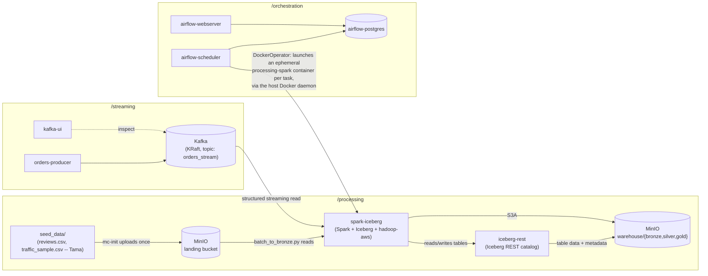

# Architecture

## Component ownership

| Folder | Owns | Docker Compose |
|---|---|---|
| `/streaming` | Kafka (KRaft), topic creation, the `orders_stream` producer | `streaming/docker-compose.yml` |
| `/processing` | MinIO (data lake), Iceberg REST catalog, the Spark runtime image + all Spark job scripts | `processing/docker-compose.yml` |
| `/orchestration` | Airflow (scheduler/webserver/metadata DB), DAGs | `orchestration/docker-compose.yml` |

All three compose files join one external Docker network, `bigdata_net`, created
once up front (`docker network create bigdata_net`) so containers can address
each other by service name (`kafka`, `minio`, `iceberg-rest`, `spark-iceberg`)
regardless of which compose file started them.

## The three data sources

Per the team's own design (`McDonald's analysis.pdf`, Data Sources Overview),
each source plays a different role -- this shapes how each one enters the
system:

| Source | Role | Entry point |
|---|---|---|
| Food Delivery (orders) | real-time streaming | Kafka `orders_stream` topic (`/streaming`) |
| Store Reviews | **late-arrival** (review_time trails ingestion_time by hours/days) | batch file -> MinIO `landing` bucket (`/processing/seed_data`) |
| Traffic (TrafficTab23) | static/batch context data | batch file -> MinIO `landing` bucket (`/processing/seed_data`) |

Traffic replaced the originally planned Stores dataset, per the lecturer's
feedback on the mid-term submission. Consequently `dim_store` (SCD Type 2) is
not loaded from any external file -- it is derived during processing from the
store IDs that link the three sources together.

Reviews and Traffic are real datasets Tama sources directly (Traffic is
committed as a reproducible 20,000-row random sample of the full 571MB file --
`processing/data_prep/create_traffic_sample.py` regenerates it); the infra
side only provides the landing zone they get uploaded into (see
`processing/seed_data/README.md`) and the Spark environment to read them
(`s3a://landing/...`). The 48-hour late-arrival requirement is primarily
about Reviews, not orders -- the orders producer backdating some events is
just a secondary bonus demonstration on the streaming side.

## Service topology

## Why Spark only ever runs in `/processing` containers

The assignment disqualifies submissions where Spark executes outside a
`/processing` container. Airflow never runs `spark-submit` itself. Instead,
`airflow-scheduler` mounts the host's Docker socket (`/var/run/docker.sock`) and
uses `DockerOperator` to ask the **host's** Docker daemon to start a brand-new
container from the `processing-spark:latest` image for every task, run
`spark-submit` inside it, stream its logs back into the Airflow task log, and
remove the container on success. The Spark driver and all execution happen
inside that ephemeral `/processing`-built container -- the Airflow container
itself never imports or runs Spark.

The same `processing-spark:latest` image also backs the always-on
`spark-iceberg` service (idling on `tail -f /dev/null`), which exists purely so
a human can `docker exec` into it to run ad-hoc `spark-sql`/PySpark for demoing
table contents -- it is not otherwise part of the pipeline.

## Bronze / Silver / Gold in MinIO

A single MinIO bucket, `warehouse`, holds all three layers as Iceberg
namespaces: `lake.bronze`, `lake.silver`, `lake.gold` (catalog name `lake`).
Iceberg places each namespace's tables under `warehouse/<namespace>/<table>/`,
which is what gives the literal `bronze/`, `silver/`, `gold/` folder structure
the assignment asks for. A second bucket, `landing`, holds the raw,
pre-Iceberg batch files (Reviews, Traffic) that `batch_to_bronze.py` reads to
produce the first bronze tables (`lake.bronze.reviews_raw`,
`lake.bronze.traffic_raw`) -- see `/processing/jobs/README.md` for the
exact catalog contract Spark jobs must follow. (Dedicated data-model docs with
the per-layer table designs are still to be added under `/docs` alongside the
silver/gold jobs.)

## Orchestration: two DAGs

- `main_pipeline_dag` (daily): `load_batch_to_bronze` -> `run_bronze_to_silver`
  -> `build_silver_conformed` -> `build_gold_dimensions` ->
  `update_scd2_dim_store` -> `build_gold_facts` -> `build_gold_aggregates` ->
  `run_quality_checks`.
- `stream_ingestion_dag` (every 5 minutes): drains whatever has landed in the
  `orders_stream` Kafka topic since the last run into bronze, via Spark
  Structured Streaming with `trigger(availableNow=True)`.

Both DAGs are created **paused** (`AIRFLOW__CORE__DAGS_ARE_PAUSED_AT_CREATION:
"true"`) so a scheduler restart never auto-triggers a run before
`processing`/`streaming` are confirmed healthy; unpause each manually from the
UI once they are. Both DAGs use the same ephemeral-container execution model
described above. Retries (2x, with a short delay) and an `on_failure_callback`
that logs a clear failure message give basic error handling/alerting without
needing an external alerting service.
