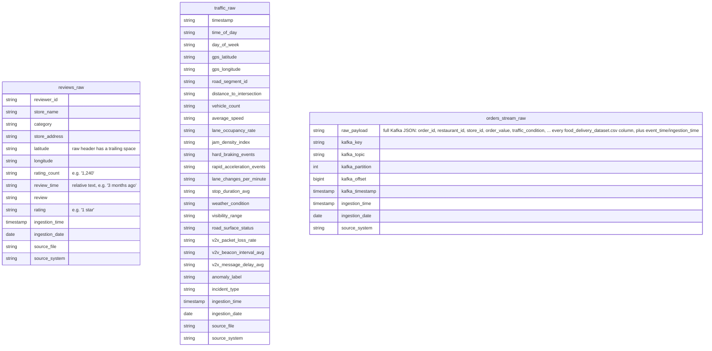
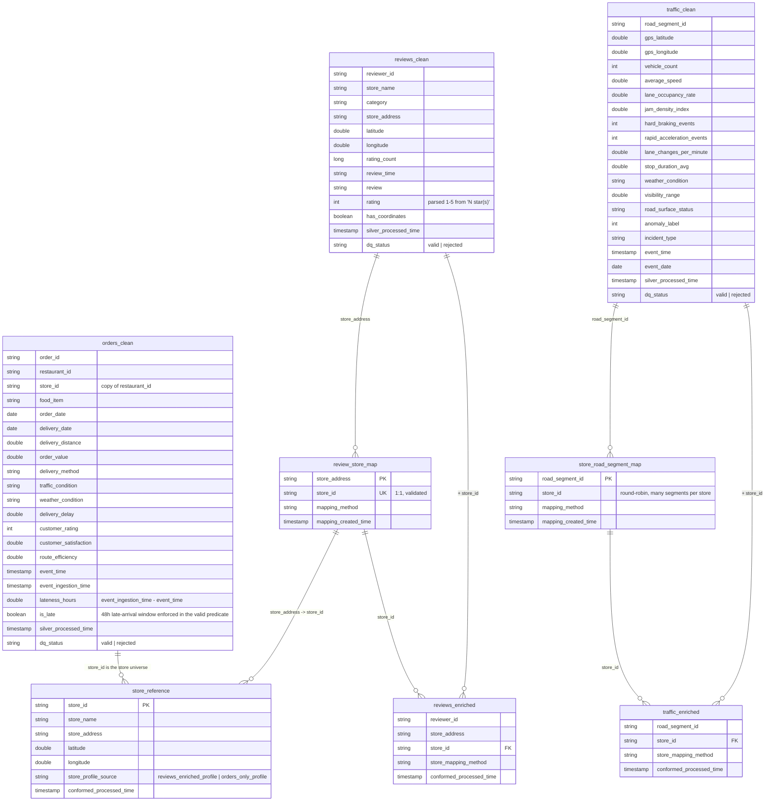
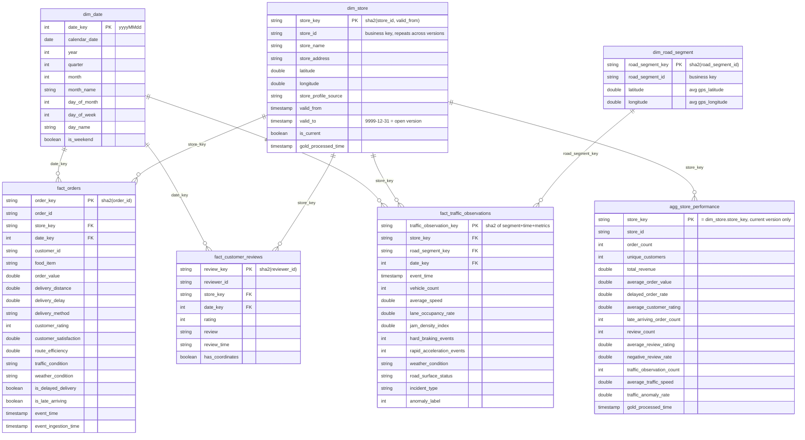

# Data Model — Bronze / Silver / Gold

Generated directly from the Spark job definitions in `processing/jobs/` (not an
idealized model) -- every attribute below is a real column the corresponding
job writes. Catalog: `lake` (Iceberg REST). Namespaces map 1:1 to the sections
below (`lake.bronze`, `lake.silver`, `lake.gold`).

## Layer lineage

```mermaid
flowchart LR
    subgraph Sources
        reviewscsv["reviews.csv"]
        trafficcsv["traffic_sample.csv"]
        kafka[("Kafka topic\norders_stream")]
    end

    subgraph Bronze
        reviews_raw
        traffic_raw
        orders_stream_raw
    end

    subgraph Silver
        reviews_clean
        traffic_clean
        orders_clean
        store_reference
        review_store_map
        reviews_enriched
        store_road_segment_map
        traffic_enriched
    end

    subgraph Gold
        dim_date
        dim_store["dim_store (SCD2)"]
        dim_road_segment
        fact_orders
        fact_customer_reviews
        fact_traffic_observations
        agg_store_performance
    end

    reviewscsv -->|batch_to_bronze.py| reviews_raw
    trafficcsv -->|batch_to_bronze.py| traffic_raw
    kafka -->|stream_orders_to_bronze.py| orders_stream_raw

    reviews_raw -->|bronze_to_silver.py| reviews_clean
    traffic_raw -->|bronze_to_silver.py| traffic_clean
    orders_stream_raw -->|bronze_to_silver.py, parses raw_payload JSON| orders_clean

    orders_clean -->|build_silver_conformed.py| store_reference
    reviews_clean -->|build_silver_conformed.py| review_store_map
    review_store_map --> store_reference
    reviews_clean -->|+ store_id| reviews_enriched
    review_store_map --> reviews_enriched
    traffic_clean -->|build_silver_conformed.py| store_road_segment_map
    traffic_clean -->|+ store_id| traffic_enriched
    store_road_segment_map --> traffic_enriched

    orders_clean -->|build_gold_dimensions.py| dim_date
    reviews_enriched --> dim_date
    traffic_enriched --> dim_date
    traffic_enriched -->|build_gold_dimensions.py| dim_road_segment
    store_reference -->|scd2_dim_store.py| dim_store

    orders_clean -->|build_gold_facts.py| fact_orders
    reviews_enriched -->|build_gold_facts.py| fact_customer_reviews
    traffic_enriched -->|build_gold_facts.py| fact_traffic_observations
    dim_store --> fact_orders
    dim_store --> fact_customer_reviews
    dim_store --> fact_traffic_observations
    dim_road_segment --> fact_traffic_observations

    fact_orders -->|build_gold_aggregates.py| agg_store_performance
    fact_customer_reviews --> agg_store_performance
    fact_traffic_observations --> agg_store_performance
    dim_store --> agg_store_performance
```

Every clean/enriched/fact/dim table also gets `*_clean`/`*_rejected` (Silver)
or a `dq_status` column split via `bronze_to_silver.py`'s
`write_quality_results`, and 25 automated checks run across all three layers
in `processing/jobs/data_quality_checks.py` (see that file / `docs/setup.md`).

## Bronze layer

Raw landing tables. One row per source record, no transformation beyond
adding ingestion metadata. `reviews_raw`/`traffic_raw` keep every source
column verbatim as `string` (`inferSchema=False`); `orders_stream_raw` stores
the *entire* Kafka message as one JSON string (`raw_payload`) plus the Kafka
envelope -- parsing into typed fields happens only in Silver.

## Silver layer

`bronze_to_silver.py` casts/normalizes each Bronze table and splits it into a
`_clean` and `_rejected` pair on the same schema plus `dq_status`
(`reviews_rejected`/`traffic_rejected`/`orders_rejected` are schema-identical
to their `_clean` counterpart, omitted below to avoid duplication).
`build_silver_conformed.py` then links all three sources, which don't share a
natural key, through two **persistent** mapping tables (new rows only ever
get appended, existing mappings are never regenerated).

## Gold layer (star schema)

`dim_store` is a **Type 2 SCD** (`scd2_dim_store.py`): a change in
`store_name`/`store_address`/`latitude`/`longitude`/`store_profile_source`
closes the current version (`valid_to` = now, `is_current` = false) and opens
a new one; unchanged attributes append nothing. Open versions carry
`valid_to = 9999-12-31` (no `NULL` sentinel). Every fact row resolves its
`store_key` by joining on `store_id` **and** `event_time` falling inside
`[valid_from, valid_to)`, so a fact always points at the dimension version
that was active when the event happened.

`build_gold_facts.py` validates every fact table on write: no null primary or
foreign keys, no duplicate primary keys. `scd2_dim_store.py` validates
`dim_store` on every run: at most one `is_current` version per `store_id`,
and no overlapping/invalid `[valid_from, valid_to)` periods.
